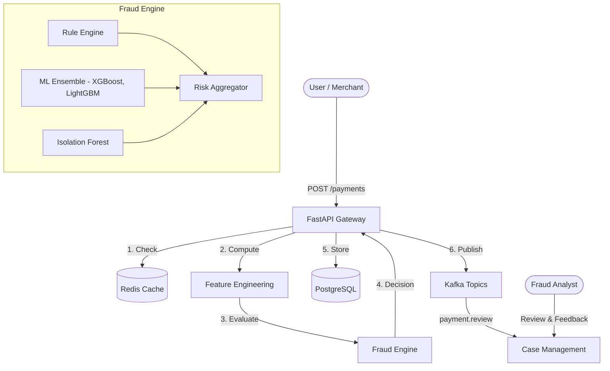

# Payment Processing & Fraud Detection Platform

   

A production-grade platform for real-time payment processing, multi-model fraud scoring, case management, and monitoring. This platform transforms a standard static ML fraud detection script into a robust, event-driven distributed system.

## 🌟 Key Features

*   **Real-Time Payment API:** Process payments instantly with idempotency checks and lifecycle state tracking.
*   **Leakage-Free ML Pipeline:** Robust data ingestion, feature engineering, temporal splitting, and scaling.
*   **Multi-Model Ensemble:** Combines XGBoost, LightGBM, Random Forest, and Isolation Forest models.
*   **Rule Engine:** Deterministic rule evaluation (e.g., Velocity, Volume, Impossible Travel) overriding or augmenting ML scores.
*   **Risk Aggregator:** Calculates a composite 0-100 risk score and routes payments (ALLOW, REVIEW, BLOCK).
*   **Case Management:** Analyst workflow to review flagged transactions, add feedback, and escalate.
*   **Event-Driven Architecture:** Kafka integration for decoupled fraud checks and audit logging.
*   **Observability:** Built-in drift detection, health checks, and statistical dashboards.

## 🏗️ Architecture



## 🚀 Quick Start (Docker)

The easiest way to run the entire platform is using Docker Compose.

1.  **Clone the repo and configure environment:**
    ```bash
    git clone https://github.com/secbyharshit19/Fraud-Detection.git
    cd Fraud-Detection
    cp .env.example .env
    ```

2.  **Start the services (PostgreSQL, Redis, Kafka, API):**
    ```bash
    docker-compose up -d --build
    ```

3.  **Run the interactive demo script:**
    ```bash
    python scripts/run_demo.py
    ```

4.  **Access the API Documentation:**
    Navigate to `http://localhost:8000/docs` to see the Swagger UI.

## 🧠 Machine Learning Pipeline

To re-train the models locally, ensure you have Python 3.11 installed, then:

```bash
# 1. Install dependencies
pip install -r requirements.txt

# 2. Run the full pipeline (ingest, feature engineer, split, train, evaluate, register)
python scripts/train_all_models.py
```

### Addressing Data Leakage
The original iteration of this project contained critical data leakage in rolling window features. This platform corrects those flaws by computing velocity features strictly across temporal windows (avoiding target leakage) and properly scaling data post-split. See `docs/DATA_LEAKAGE_AUDIT.md` for details.

## 📂 Project Structure

```
├── artifacts/            # Training run metadata and evaluation reports
├── data/                 # Synthetic & Processed datasets
├── docs/                 # Architectural documentation and audits
├── models/               # Saved ML models (.pkl) and registry
├── scripts/              # Demo, generation, and training scripts
├── src/                  # Main application source code
│   ├── api/              # FastAPI application and endpoints
│   ├── cases/            # Fraud case management
│   ├── config/           # Centralized configuration (Settings)
│   ├── data/             # ML data pipeline (ingestion, features, scaling)
│   ├── database/         # PostgreSQL repository and connection pooling
│   ├── fraud/            # Core fraud engine (rules, risk aggregation, explanation)
│   ├── kafka_module/     # Kafka producers and consumers
│   ├── ml/               # Model training scripts and threshold optimization
│   ├── monitoring/       # Metrics, drift detection, and health checks
│   ├── payment/          # Payment lifecycle and idempotency
│   ├── redis_module/     # Redis client implementation
│   └── schemas/          # Pydantic data models
├── tests/                # Unit tests
├── docker-compose.yml    # Infrastructure definitions
└── Dockerfile            # API container specification
```
